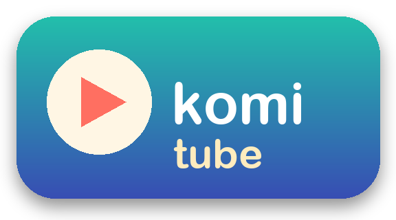

# komi-tube — PSP単体で動くYouTubeクライアント



PSP自身がWi-FiでYouTubeへ接続し、動画を取得・再生するためのプロジェクトです。再生時のPC、中継サーバー、クラウド変換は使いません。Macはビルドとエミュレーターでの開発にだけ使用します。

PSP本体が保存済みのWi-Fi設定を使ってYouTubeへ直接接続し、検索・ページ表示・動画取得を行うネイティブクライアントです。PC、中継サーバー、クラウド変換は再生時に使いません。GoTubeの公式後継ではなく、現代のYouTubeに合わせた非公式の再実装です。

PSP-3000（CFW）の実機で、検索・動画の連続再生まで確認しています。確認内容と未確認項目は [検証記録](docs/VERIFICATION.md) と [開発メモ](docs/HANDOFF.md) を参照してください。

## 新しいアプリ：komi-tube（新）

ブラウザを使わずに作り直した版です（`komi-tube-native.zip`）。従来のkomi-tubeと別のフォルダ（`PSP/GAME/KOMI_NATIVE`）に入るので、両方を並べて使えます。

- **検索**：本体のキーボードでひらがなを入力すると、漢字の変換候補とYouTubeの検索候補が一覧で出ます。選んで決定すると検索します（本体キーボードの漢字変換は自作アプリからは使えないため、アプリ側で変換しています）。
- **結果一覧**：1ページ最大20件。L/Rで前後のページへ移動します。
- **関連動画**：一覧・マイリスト・再生中に□。
- **マイリスト**：一覧や再生中に△で追加・解除（♥印）。PSP本体の中（`komi-mylist.txt`）だけに保存します。
- **ボタン**：決定・戻るは本体設定（○決定／×決定）に合わせます。再生中は←→で10秒移動。ホームでSTARTを押すと終了します。
- 再生中は画面が暗くならず、自動スリープもしません。

入れ方：`komi-tube-native.zip` を展開し、中の `PSP/GAME/KOMI_NATIVE` をメモリースティックの同じ場所へコピーして、「komi-tube（新）」を起動します。Wi-Fiは従来版と同じく前回のアクセスポイントへ自動で接続します。

### 通信先について

どちらの版も、PSPから次のサービスへ直接接続します。APIキーやアカウント情報は使わず、アプリにも含めていません。

- YouTube（`m.youtube.com` の検索・動画情報のAPI、動画本体の配信サーバー）
- 新しいアプリの漢字変換のみ：Googleの日本語変換（`www.google.com/transliterate`）と検索候補（`suggestqueries.google.com`）。ひらがなで入力した検索語がGoogleへ送られます。

## 実機に入れる

1. `dist/komi-tube.zip` を展開します。
2. 中の `PSP/GAME/KOMI_TUBE` フォルダを、PSPのメモリースティックの同じ場所へコピーします。`slot-a`、`slot-b`、`data`、`NOTICES` なども必要です。
3. PSPの「設定 → ネットワーク設定 → インフラストラクチャーモード」でWi-Fi接続を保存し、**接続テストが通ることを確認**します。
4. PSPの「ゲーム → メモリースティック」から **komi-tube** を起動します。
5. 起動すると、前回使ったアクセスポイントへ自動で接続します。つながらない場合だけPSP標準の「アクセスポイントに接続」画面が開くので、保存済みの接続を選んでください。接続できなかった場合は「もう一度接続画面を開きますか？」と聞かれ、「はい」で再試行、「いいえ」でアプリを終了します。
6. 起動後はそのままYouTubeのホームが開きます。STARTを押し、検索語を入力します。結果から動画を選び、Playを押すと再生します。

既に使ったフォルダへの上書きでは、`data` 内に検索・画質などの設定が保存されています。再インストール時はバックアップしてから作業してください。

## 対象と制約

- Homebrewを起動できるPSPが必要です。CFWの導入や実機の改変はこのプロジェクトでは行いません。
- 実機確認対象は **PSP-3000 / 64MB**。PSP-2000とPSP goもメモリ条件を満たす構成ですが、PSP-1000 / 32MBは対象外です。PSP StreetはWi-Fiがありません。
- PSPが参加できるWi-Fiが必要です。PSPは2.4GHz・802.11b専用です。ルーターが「g/nのみ」「WPA3」「5GHzのみ」だとPSP本体の接続テストから失敗します。その場合はWPA2-PSK(AES)またはWPA(TKIP)の2.4GHz SSID（ゲスト用など）を用意してください。ルーターの設定は自動で変更しません。
- 既定画質は360p。通信や再生が重い場合はSettingsのMedia設定で240pに変更できます。
- PSPのファームウェアが扱えるH.264 Baseline/MainとAAC-LCの経路を利用します。すべてのYouTube動画が再生できるわけではありません。
- ログイン、年齢制限、有料・会員限定コンテンツや、YouTube側が追加トークンを要求する配信は対象外です。取得できない場合はエラーを表示します。
- 日本語の検索語はUTF-8でYouTubeへ送信します。PSP本体のシステム言語を日本語にすると、システムキーボードから日本語を入力できます。日本語の動画言語設定と内蔵CJKフォントも有効にしています。操作UIは主に英語です。
- 自動の更新確認はこのパッケージでは無効にしています。エンジンを更新する場合は依存コミットを明示的に更新して再検証します。
- 証明書・ホスト名の検証を有効にしたHTTPSで通信します。PSPの日時が大きくずれている場合は合わせてください。

## 基本操作

| ボタン | 操作 |
|---|---|
| 十字キー | リンクや操作項目の選択 |
| アナログ | カーソル移動 |
| × | 決定・リンクを開く |
| ○ | 戻る・読み込みの取り消し |
| START | YouTube検索（入力した文字はYouTubeで検索。YouTubeのURLはそのまま開く） |
| SELECT | メニュー（設定・ライブラリ・終了など） |
| △ | ブラウザーの操作バーを表示・非表示 |
| L / R | ページ移動 |
| HOME | PSPの終了画面 |

文字入力はPSPのシステムキーボードを使用します。SettingsでDanzeff入力へ切り替えることもできます。

## 開発

現在のセットアップスクリプトは **Apple SiliconのmacOS** 用です。Xcode Command Line Tools、Git、curl、Python 3.12以上が必要です。

```sh
./scripts/bootstrap.sh
./scripts/build.sh
./scripts/test.sh
```

SDK、SDKが必要とするMac用共有ライブラリ、PPSSPPは `tools/` に入ります。Pythonの依存は `.venv/` に入ります。Homebrewへのパッケージ追加やシェル設定の変更はしません。初回は依存ソースのダウンロードとコンパイルに時間がかかり、数GBの空き容量が必要です。

- `vendor/tilefinch/`: PSP向けブラウザー・通信・メディア実装。[Tilefinch](https://github.com/stjanovitz/tilefinch)（MIT）を取り込んで変更したソース。元のライセンスと第三者通知は同じフォルダの `LICENSE` と `THIRD_PARTY_NOTICES.md` にあります。
- `sources.lock.json`: SDK・PPSSPPのバージョンとSHA-256、取り込んだTilefinchの元コミット。
- `config/`: YouTube起動と日本語・360p・更新確認OFFの初期設定。
- `scripts/`: 環境構築、PSPクロスビルド、テスト、パッケージ生成。
- `dist/`: ビルド後のPSPインストール用フォルダとZIP。
- `tools/downloads/`: 開発時のダウンロードとログ。Gitには含めません。通信ログに期限付き動画URLなどが含まれることがあるため、そのまま公開しないでください。

`build.sh` はPSPのコードサイズ検査と第三者ライセンス収録の検査を通してからパッケージを生成します。コンパイラはPSP用の `ar` / `ranlib` を明示し、Mac用のアーカイバーが混ざるのを防ぎます。

## ありがとう

komi-tubeがPSP単体でYouTubeにつながり、動画を再生できるのは、[Steven Janovitz](https://github.com/stjanovitz)さんが作った **[Tilefinch](https://github.com/stjanovitz/tilefinch)** のおかげです。PSPで動くブラウザーそのものから、HTTPS通信、YouTubeの動画情報の取得、PSPのメディアエンジンを使ったデコードまで、このアプリの土台はほぼすべてTilefinchの成果です。「今のYouTubeをPSPで見る」という無茶を現実にしてくれたことに、心から感謝します。YouTube対応の仕組みは [Tilefinchの解説](https://github.com/stjanovitz/tilefinch/blob/main/docs/engineering/YOUTUBE_VIDEO_LAB.md) に詳しくまとまっています。

かつてPSPでYouTubeを見せてくれたGoTubeと、その作者の方にも感謝します。komi-tubeはその思い出から始まった、非公式の作り直しです（GoTubeの公式な後継ではありません）。

ほかにも、Lexbor、QuickJS、curl、mbed TLS、nghttp2、FreeType、libwebpなどのライブラリの作者の皆さん、フォントの作者の皆さん、[PSPDEV](https://github.com/pspdev/pspdev)（PSPSDK）を今も保守しているコミュニティの皆さん、開発に使わせてもらった [PPSSPP](https://github.com/hrydgard/ppsspp) の皆さんに感謝します。

縦持ちでショートを見る派生版の [dopagaki-portable](https://github.com/kouminiku-9900/dopagaki-portable) も、このリポジトリから生まれました。

## ライセンス

- **このリポジトリで書いたコード・スクリプト・アイコン**：MITライセンスです（[LICENSE](LICENSE)）。
- **Tilefinch**（`vendor/tilefinch/`）：MITライセンス（© 2026 Steven Janovitz）。PSP向けに手を入れたものを取り込んでいます。元のライセンスは [vendor/tilefinch/LICENSE](vendor/tilefinch/LICENSE)、同梱ライブラリの一覧は [vendor/tilefinch/THIRD_PARTY_NOTICES.md](vendor/tilefinch/THIRD_PARTY_NOTICES.md) にあります。
- **同梱しているライブラリ**は、MIT・BSD・Apache-2.0・FreeTypeライセンス・SIL OFL 1.1（フォント）などの、自由に配布できるライセンスのものです。PSPのSDKに含まれるpthread-embeddedはLGPL-2.1以降です。このアプリのソースコードとビルド手順はすべてこのリポジトリで公開しているので、差し替えたライブラリでビルドし直すことができます。
- **アプリ本体（EBOOT）にはGPLのコードを含んでいません。** CFWの機能を呼び出す部分も、GPLのSDKではなく、Tilefinchが自前で書いたMITの宣言を使っています。
- 例外は `OPTIONAL/tilefinch_xmb.prx`（入れたい人だけが使う、XMBから起動するためのプラグイン）です。これはCFWのSDK（GPL-3.0）を使っているため、**このファイルだけはGPL-3.0として配布**しています。ソースは [vendor/tilefinch/src/psp_xmb_redirect.c](vendor/tilefinch/src/psp_xmb_redirect.c) で公開していて、ライセンス文は配布ZIPの `NOTICES/pspdev/psp-cfw-sdk/` にあります。
- 配布ZIPの `NOTICES` フォルダに、ライセンス文と第三者通知をすべて入れています。

## 免責事項

- komi-tubeは個人が趣味で作った**非公式**のソフトです。YouTube、Google、ソニーグループ、Tilefinchの作者、GoTubeの作者とは一切関係がなく、各社・各作者の承認も受けていません。YouTube、PSP、PlayStationは各社の商標です。
- **無保証です。** このソフトを使ったこと、または使えなかったことによって生じたいかなる損害（本体の故障や起動不能、データの消失、通信費などを含みます）についても、作者は責任を負いません。すべて自己責任でお使いください。
- CFW（カスタムファームウェア）の導入はこのリポジトリの対象外です。導入方法の案内やファイルの配布は行いません。
- 非公式のアプリからYouTubeを見ることが、YouTubeの利用規約に沿っているかどうかは保証できません。ご自身で判断したうえでお使いください。動画のダウンロードや再配布、有料・会員限定コンテンツを見るための回避には使わないでください。表示される動画の権利は、それぞれの投稿者にあります。
- YouTube側の仕組みが変わると、予告なく動かなくなることがあります。動作やサポートの継続は約束できません。
- アプリは、アカウント情報やAPIキーを使いません。ただし、検索語（新しいアプリでひらがなを入力した場合はGoogleの変換サービスにも）はインターネットに送られます。
